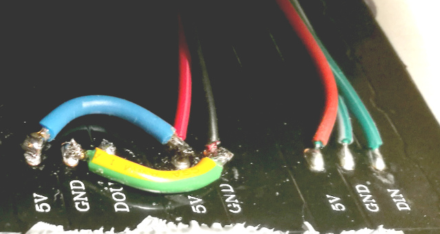
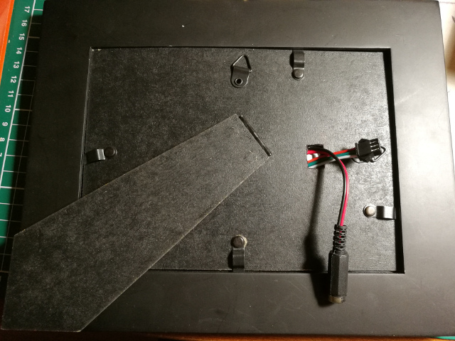

Wifi pond
=========

_A square of programmable RGB WS2812B LEDS connected to a
Wifi sniffer to assign every MAC address a flicker of light._

__Status: shining bright from a dark and damp code base__

Hardware
--------

- [WEMOS D1 mini](https://www.aliexpress.com/item/D1-mini-Mini-NodeMcu-4M-bytes-Lua-WIFI-Internet-of-Things-development-board-based-ESP8266/32529101036.html) board
- An [8x8 array of WS2812B leds ](https://www.aliexpress.com/item/8x32-Pixel-256-Pixels-WS2812B-Digital-Flexible-LED-Panel-Individually-Addressable-Full-Dream-Color-DC5V/32776887881.html)
- A [beefy 5V 6A adapter](https://www.aliexpress.com/item/EU-US-UK-AU-Power-Supply-Adapter-Transformer-AC-110-240V-to-DC-5V-12V-24V/32776767537.html) to allow the LEDS to shine
- A frame to put it all in
- Some baking paper, to dissipate the light a bit
- A [2.5mm DC jack](https://www.aliexpress.com/item/20pcs-Connector-DC-Power-5-5mm-x-2-5mm-female-jack-socket-RF-COAXIAL-CCTV/32727861732.html) to connect up the power supply nicely
- A button, one will do but I ended up buying [a collection of different buttons](https://www.aliexpress.com/item/Free-shipping-10-Kinds-of-Tactile-Switches-Push-Button-SMD-Tact-Switch-Switch-100Pcs-lot/32728800916.html)

Connections
-----------

On the [WEMOS D1](https://wiki.wemos.cc/products:d1:d1_mini):
- Connected D2 to the RGB led DIN (Data In) line
- Connected GND to the ground of the 5V
- Connected 5V to 5V power supply
- Put simple push-button between 3.3V and D8. D8 has a build-in pull-down 10K resistor, so direct connection should not be a problem

On the LED array:
- Desolder one of the connectors, the data out one, and re-use it to connect up the WEMOS on the other end.
- Connect up the 5V and GND lines just to make sure enough amps can go to either side of the strip (probably pointless, but I liked the extra soldering)

On the frame, make a few holes and put in the led array.

Software
--------
- [Arduino IDE](https://www.arduino.cc/en/Main/Software) with
    - The Adafruit NeoPixel library, installed via IDE library manager
    - The ESP8266WiFi library, installed via IDE library manager
    - The [WEMOS D1 compiler and configuration setup](https://wiki.wemos.cc/tutorials:get_started:get_started_in_arduino)
- The `wifipond.ino` file from this repository

Result
------

https://drive.google.com/open?id=1LEcKE2glpTXbk8xvIVeoEQVKUeSSFgIa